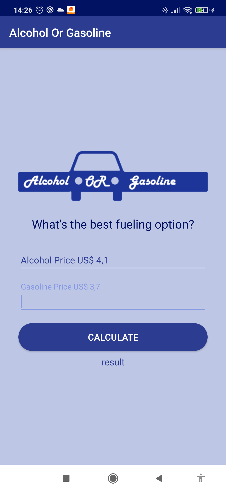

# Android Studio Course
The course has about 107 hours of content, the main goal is to push an exercise per day.

## Alcohol or Gas

In this exercise I made an app to check if it's best to use alcohol or gas according to the price.

  

---

### Tools

- [Java](https://www.java.com/pt-BR/)
- [Android Studio 3.5](https://developer.android.com/studio?hl=pt-br)

### Setup

You can download the repository and run inside Android Studio 3.5+
